# PrayerHubApp — Database ERD (Phase 1–4 core)

```mermaid
erDiagram
  USERS ||--o{ SESSIONS : has
  USERS ||--o{ DEVICES : has
  USERS ||--o{ USER_ROLES : has
  ROLES ||--o{ USER_ROLES : grants
  USERS ||--o{ FOLLOWS : "follower"
  USERS ||--o{ FOLLOWS : "followee"
  USERS ||--o{ BLOCKS : blocks
  USERS ||--o{ GROUP_MEMBERS : joins
  GROUPS ||--o{ GROUP_MEMBERS : has
  GROUPS ||--o{ GROUP_INVITES : has
  USERS ||--o{ PRAYER_REQUESTS : creates
  GROUPS ||--o{ PRAYER_REQUESTS : "scoped to"
  PRAYER_REQUESTS ||--o{ PRAYER_INTERACTIONS : receives
  PRAYER_REQUESTS ||--o{ PRAYER_COMMENTS : receives
  USERS ||--o{ PRAYER_JOURNALS : keeps
  USERS ||--o{ TESTIMONIES : shares
  USERS ||--o{ LIVE_ROOMS : hosts
  GROUPS ||--o{ LIVE_ROOMS : "scoped to"
  LIVE_ROOMS ||--o{ ROOM_PARTICIPANTS : has
  LIVE_ROOMS ||--o{ ROOM_EVENTS : logs
  USERS ||--o{ SCHEDULED_ROOMS : schedules
  GROUPS ||--o{ BIBLE_STUDIES : hosts
  BIBLE_STUDIES ||--o{ STUDY_SESSIONS : has
  BIBLE_STUDIES ||--o{ STUDY_MEMBERS : has
  USERS ||--o{ SCRIPTURE_BOOKMARKS : saves
  ORGANIZATIONS ||--o{ ORGANIZATION_MEMBERS : has
  USERS ||--o{ CONVERSATION_MEMBERS : joins
  CONVERSATIONS ||--o{ CONVERSATION_MEMBERS : has
  CONVERSATIONS ||--o{ MESSAGES : has
  USERS ||--o{ REPORTS : files
  REPORTS ||--o{ MODERATION_CASES : becomes
  USERS ||--o{ AUDIT_LOGS : "acted by"
```

## Notes
- Every table: `id UUID PRIMARY KEY DEFAULT gen_random_uuid()`, `created_at`, `updated_at`;
  user-facing content tables also get `deleted_at` (soft delete) so moderation/audit history
  survives removal.
- `prayer_requests.visibility` is an enum (`public|followers|group|private`) and **every** read
  query is scoped by it at the repository layer, not just the controller.
- `group_members.role` and `organization_members.role` reference `roles` so permission checks
  are data-driven, not hard-coded per table.
- See `apps/api/migrations/0001_init.sql` for the executable Phase 1–2 schema (users, roles,
  sessions, devices, prayer requests/interactions/journal, groups, audit log). Later phases
  (live rooms, Bible studies, orgs, messaging) are stubbed as comments there, ready to extend.
